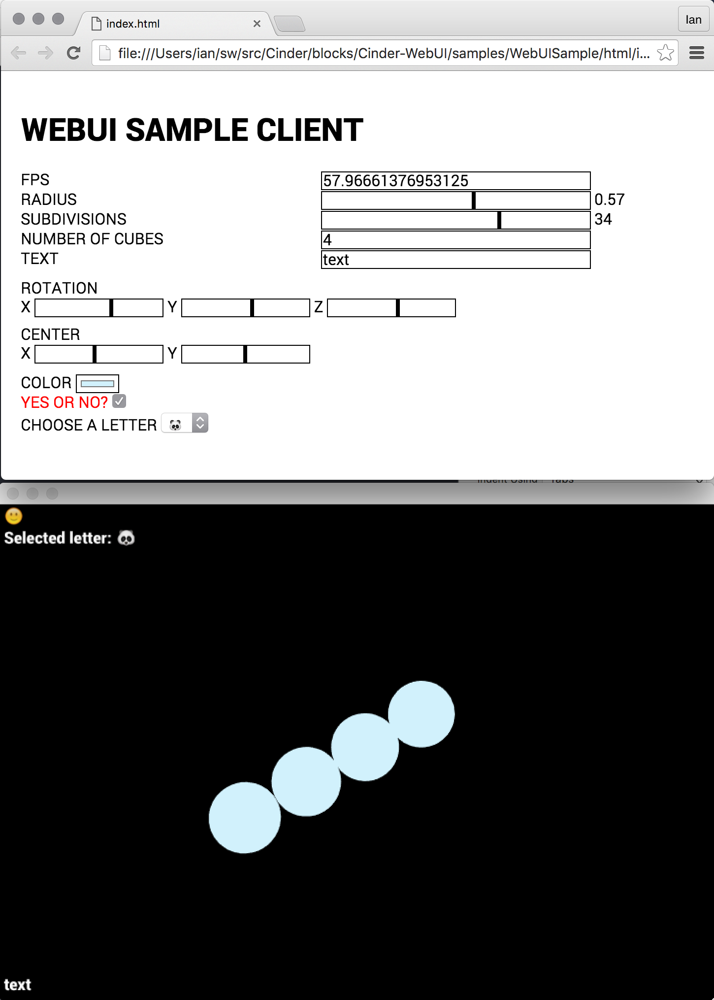

WebUI Cinder Block
==================

This [Cinder](https://libcinder.org/) Block provides a web-based
user interface for Cinder. It binds variables in the Cinder app to HTML
elements using WebSockets. Basic usage is very simple. First, in Cinder,
declare the UI and a bound parameter:

    #include "WebUI.h"

    class MyApp : public ci::app::App {
        // ...
        webui::WebUI                mUI;
        webui::BoundParam< float >  mBoundFloat;
    }

Then bind it:

    mUI.bind( "bound-float", &mBoundFloat );

Then create an HTML element and bind it to the same name:

    
    <form id="controls" action="">
      <input id="bound-float" type="number" />
    </form>
    

Sample
------

To see a fully working sample, clone this repo with its submodules, open
the [WebUISample](samples/WebUISample) project, build it, run it, and
open the [client](samples/WebUISample/html/index.html).

    cd Cinder/blocks
    git clone --recursive git@github.com:heisters/Cinder-WebUI.git
    cd Cinder-WebUI/samples/WebUISample
    open xcode/WebUISample.xcodeproj
    # build + run ...
    open html/index.html

You should see something like this:

Requirements
------------

[Cinder-WebSocketPP](https://github.com/wieden-kennedy/Cinder-WebSocketPP)
is included as a submodule. If WebUI isn't building against the latest
WebSocketPP, try using the version in the submodule.
